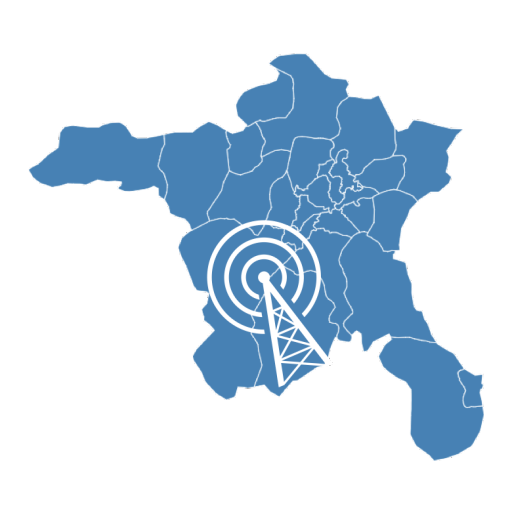
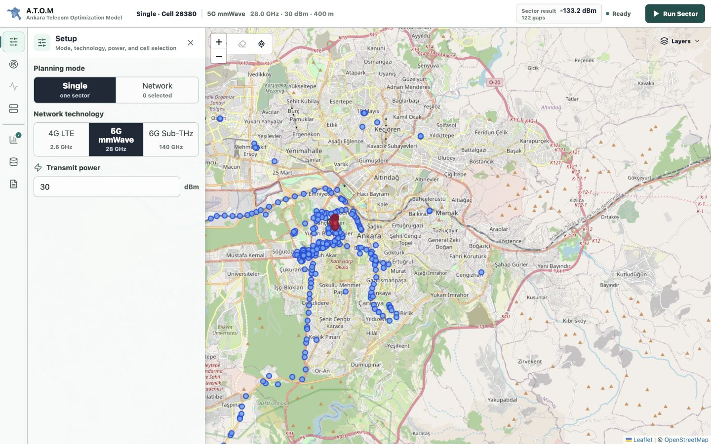

<div align="center">



# A.T.O.M

**Ankara Telecom Optimization Model | Deterministic RF Planning and Network Analysis**

[](https://go.dev/)
[](https://react.dev)
[](https://www.docker.com)
[](LICENSE)

</div>

---

## Overview

A.T.O.M is a full-stack spatial planning engine for visualizing and evaluating cellular networks across multiple generations (4G LTE, 5G mmWave, and an experimental 6G Sub-THz mode) in dense urban environments. Built on OpenStreetMap (OSM) and OpenCellID-derived data, it combines deterministic RF estimation with interactive geospatial analysis so telecommunications engineers and students can compare coverage, antenna configurations, interference, demand impact, and network topology in Ankara, Turkey.

The engine combines bounded Go worker pools, spatial indexing, deterministic ray tracing, and demand-aware search to evaluate urban RF planning scenarios. Results are planning estimates derived from static OSM and OpenCellID data; they are not drive-test, UE, or PHY measurements.

---

## Key Features

- **Focused Map Workspace**: Organizes setup, propagation, interference, 5G Core, results, data assumptions, and reports in a compact workflow rail while keeping the map primary.

- **Multi-Generation Planning Presets**: Evaluates 4G (2.6 GHz), 5G (28 GHz), and experimental 6G (140 GHz) scenarios using Free-Space Path Loss (FSPL) with frequency-dependent attenuation.

- **Segmented Heatmap Raytracing**: Generates GeoJSON ray segments that change color based on modeled signal strength (Rx dBm), providing interactive visual feedback on coverage quality.

- **Frequency-Dependent Penetration**: 4G rays penetrate concrete buildings with Cumulative Wall Loss calculations, while 5G/6G rays experience heavy attenuation or immediate blockage, reflecting real-world propagation behavior.

- **Sector Planning**: Sector antenna simulation with adjustable azimuth and beam width. Version 1 uses hard beam eligibility and does not model sidelobes, fading, diffraction, or MIMO scheduling.

- **Interference Analysis**: Produces planning-grade RSRP, SINR, RSRQ, RSSI, serving-cell, and strongest-interferer surfaces for selected 4G and 5G cells.

- **Deterministic Network Optimization**: Sweeps candidate azimuths and scores sectors or two-to-six-cell clusters using POI demand, residential-density demand, coverage, and overlap penalties.

- **Coverage Gap Finder**: Flags demand-weighted buildings inside the active beam that fall below usable service quality, helping planners see underserved residential and POI targets instead of only raw ray distance.

- **5G Communication Paths**: Separately visualizes direct Xn-C/Xn-U coordination, N2 fallback through AMF, and N3 user-plane routing through UPF when the optional 5G Core Lab overlay is enabled.

- **Operational Safeguards**: Uses request cancellation, latest-response protection, bounded worker pools, request-size limits, readiness probes, and explicit `429` overload responses.

- **Local Projects and Scenario Comparison**: Autosaves planning drafts in IndexedDB, exports versioned project files, retains reproducibility metadata, and compares two saved RF scenarios without adding another workspace tool.

- **Candidate Cell Recommendations**: Ranks known, unselected planning records inside a drawn search area by marginal coverage, POI/residential demand, and overlap. Recommendations do not claim site availability, cost, backhaul, or permitting feasibility.

- **Measurement Validation**: Imports up to 5,000 4G/5G RSRP samples, maps model residuals, reports MAE/RMSE/bias, and offers an explicitly labeled holdout-checked global dB correction when enough valid samples exist.

- **Validated Dataset Packs**: Loads a manifest-driven tower/building pack through `ATOM_DATASET_DIR`, verifies EPSG:4326 metadata and SHA-256 hashes, and exposes active dataset/model identity through `/api/meta`.

---

## Architecture & Tech Stack

| Component | Technology | Purpose |
|-----------|-----------|---------|
| **Backend** | Go (Golang) | Bounded RF worker execution, validation, resource controls, and in-memory R-Tree spatial queries |
| **Frontend** | React + Leaflet | GeoJSON and canvas-backed map layers with interactive simulation controls |
| **Data Pipeline** | Python + OSMnx | Local tower/building extraction and demand-surface enrichment |
| **Runtime Data** | Manifest + GeoJSON + CSV | Validated local dataset packs loaded into memory at startup; no database required |
| **Deployment** | Docker | Multi-stage build compiling both React and Go into a single, lightweight Alpine container |

---

## Codebase Structure

```text
backend-go/       Go API, in-memory R-tree, ray tracing, azimuth optimization
frontend-react/   React/Vite/Leaflet dashboard and RF heatmap UI
data-pipeline/    Python scripts for local tower/building data generation
docs/             GitHub Pages documentation, academic report, charts, screenshots
assets/           Source screenshots used by README/docs
Dockerfile        Production multi-stage build for the static in-memory app
```

Generated artifacts such as `frontend-react/dist/`, local virtual environments, and build caches are intentionally ignored. The large Ankara building GeoJSON is stored through Git LFS.

---

## Focused Workspace



The current interface uses a compact command bar, workflow rail, overlay tool drawer, contextual result summary, independent map layers, and persistent inspectors. Radio-parameter edits mark existing results as stale without submitting hidden requests, while **Run Sector**, **Evaluate Network**, and tool-specific analysis actions keep execution visible.

---

## Propagation Visualization

### 4G Coverage


### 5G Coverage


### 6G Sub-THz Coverage


### Auto-Optimized 5G Beamforming


*Visualizing multi-generation RF propagation patterns and deterministic antenna-placement recommendations in urban environments.*

---

## Getting Started with Docker

### Prerequisites

- Docker with Compose
- Git and [Git LFS](https://git-lfs.com/)

### Clone, Build, and Run

The 111 MB Ankara building dataset is managed by Git LFS, so clone the repository with LFS enabled:

```bash
git lfs install
git clone https://github.com/Berk-Unsal/urban-ray-tracer.git
cd urban-ray-tracer
git lfs pull
docker compose up --build -d atom
```

Open **`http://localhost:8080`** and verify readiness with `curl http://localhost:8080/readyz`.

For a settings-first verification without bundled analysis output, import [`examples/ankara-sample.atom-project.json`](examples/ankara-sample.atom-project.json) from the project menu, select two local cells, and run **Evaluate Network**.

Validate the bundled dataset pack independently:

```bash
cd backend-go
go run ./cmd/validate-dataset ../data-pipeline
```

To use another prepared geography, mount its manifest and GeoJSON files and set `ATOM_DATASET_DIR` before startup. Dataset changes require a restart.

### Optional Core Lab Mode

Core Lab Mode is opt-in. The default app does **not** start any 5G Core containers or require Open5GS.

```bash
docker compose -f docker-compose.yml -f docker-compose.core-lab.yml --profile core-lab up --build
```

This starts A.T.O.M with `CORE_LAB_ENABLED=true` and a lightweight `core-lab-adapter` sidecar at port `8090`. The adapter exposes stable Core Lab JSON for AMF, SMF, UPF, UDM/UDR, AUSF, PCF, NRF, and NSSF status. If no Open5GS endpoint is configured, scenario effects are marked as a deterministic `simulated_overlay`; point `OPEN5GS_STATUS_URL` or `OPEN5GS_METRICS_URL` at a real Open5GS lab to bridge external emulator state.

Suggested Docker memory allocation:

| Profile | Memory | Use |
|---|---:|---|
| `core-lite` | 4-6 GB | A.T.O.M + adapter status bridge |
| `core-demo` | 8-12 GB | Adapter + simulated gNB/UE session overlays |
| `core-observe` | 12-16 GB | Full Open5GS lab plus metrics/observability |

---

## Documentation

Start with the static [documentation hub](docs/index.html), then use:

- [System architecture](docs/architecture.html) for runtime components, request lifecycles, spatial data, reliability controls, and model boundaries.
- [Download and use](docs/download.html) for Docker, source development, Core Lab, troubleshooting, and guided workflows.
- [Getting started](docs/getting-started.md) for the Markdown onboarding reference.
- [REST API](docs/api.html), downloadable [OpenAPI 3.1 contract](docs/openapi.yaml), [RF algorithms](docs/algorithms.html), and [model limitations](docs/modeling-limits.html) for implementation details.
- [Academic report](docs/academic-report.pdf) and [map interpretation guide](docs/visualization.html) for deeper analysis.

---

## Author & Credits

Architected and Developed by [Berk Ünsal](https://berkunsal.com)

This project demonstrates the practical intersection of spatial algorithms, bounded concurrent systems design in Go, and planning-grade telecommunications simulation.

---

<div align="center">

**Deterministic, inspectable, and explicit about model limits.**

</div>
