# Dark-mode ray and action presentation follow-up

This patch changes ray stroke presentation and shared dark action styling only. RF calculations, classifications, thresholds, ray ordering/endpoints/counts, request payloads, readiness, persistence, basemap selection and error behavior are unchanged.

## Rays

Every ray previously used a 4 px stroke at 0.8 opacity. Hundreds of overlapping strokes obscured the map, especially against the subdued dark basemap. `rayPresentation` now returns a **1.25 px stroke at 0.45 opacity**, equally in light and dark. It calls the same `rxPowerColor` with the same signal value/default. Semantic hues remain strong `#10b981`, usable `#f59e0b`, and below sensitivity `#e11d48`. There is no existing ray hover/inspection emphasis; no interaction was added.

Matched real Alidade captures use deterministic fixtures: 720 rays across two selected Cells with an RSRP overlay, and a 24-ray sector. The before/after canvas path commands, semantic colors and ordering match exactly for every ray; RF request payloads also match. Dense fields show separate spokes and underlying roads/building texture instead of an opaque outer disk. Overlap remains at the common ray origins, as expected without removing rays. Selected Cell order labels remain legible and sparse rays retain visible structure. Building outlines and available/active Cells are visible; their presentation is unchanged. These captures are visual evidence, not additional RF validation.

| State | Before | After |
| --- | --- | --- |
| Dense RSRP, dark | 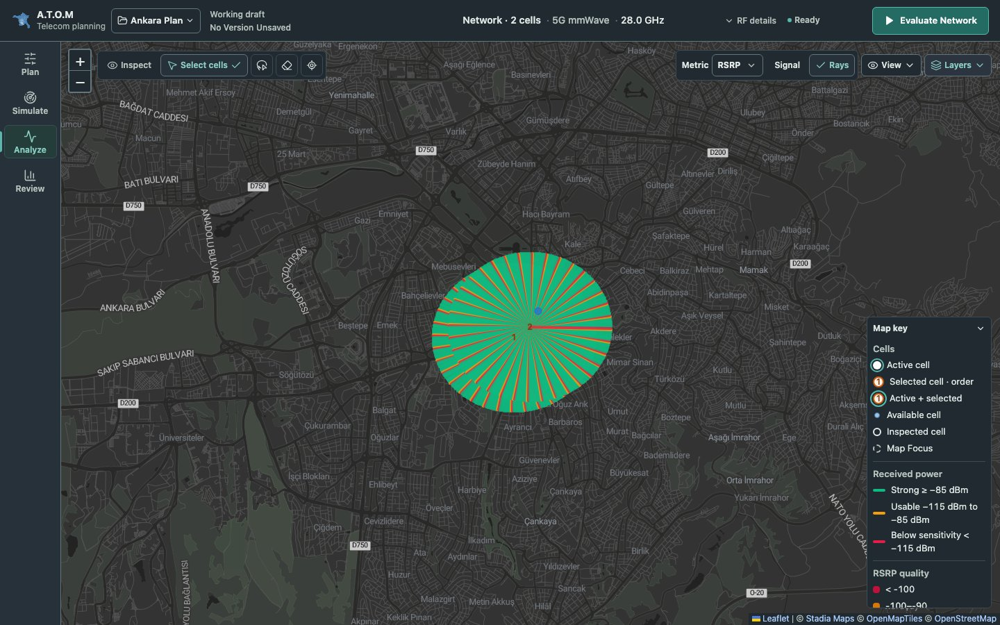 | 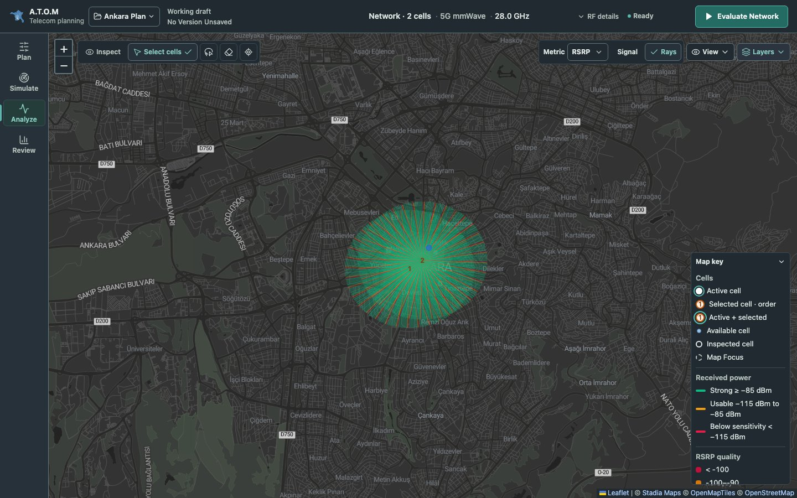 |
| Dense RSRP, light | 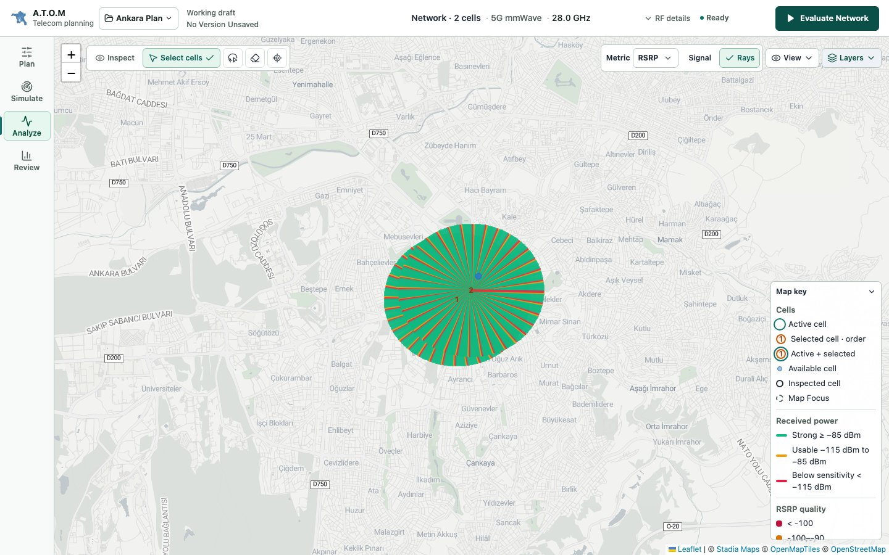 | 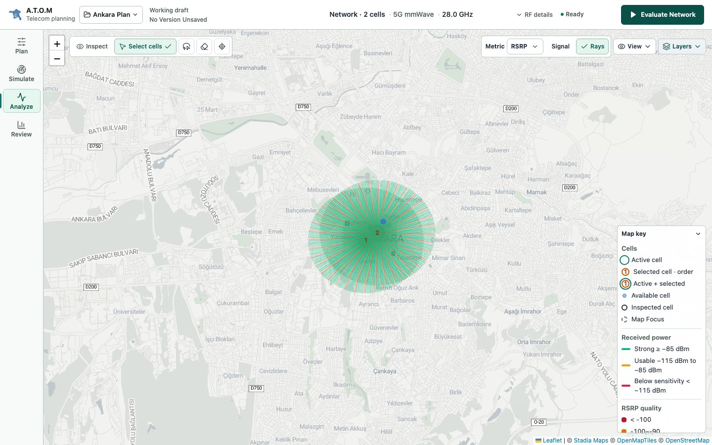 |
| Sparse sector, dark | 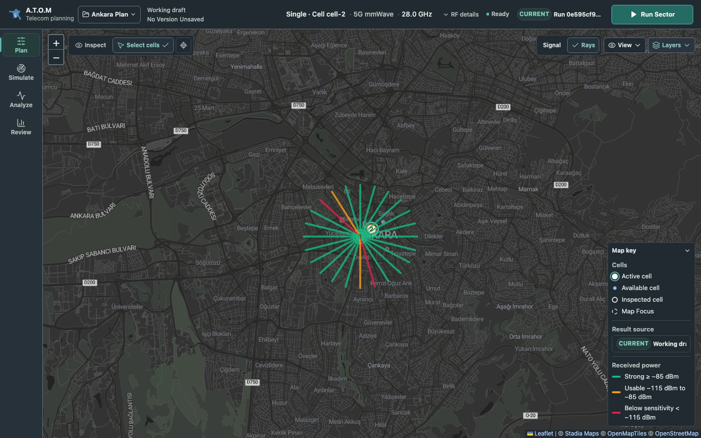 | 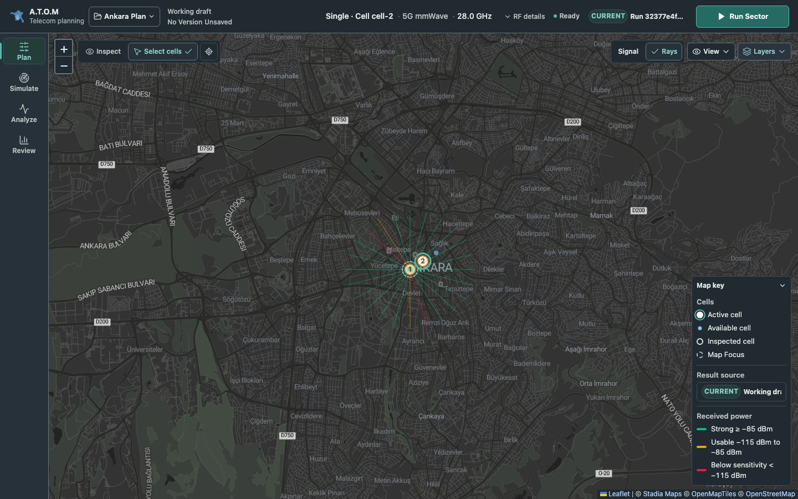 |
| Sparse sector, light | 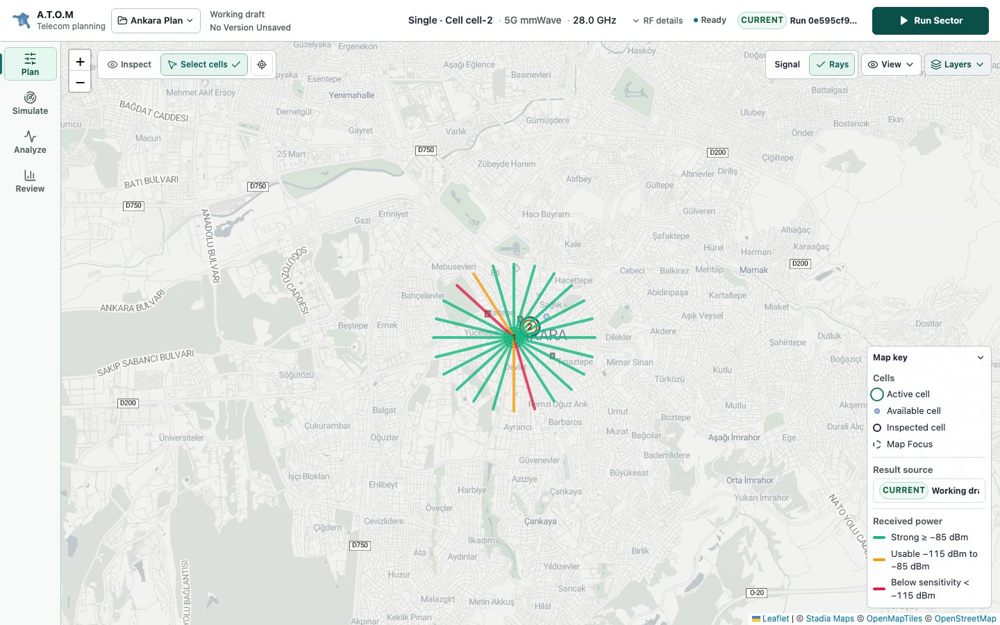 | 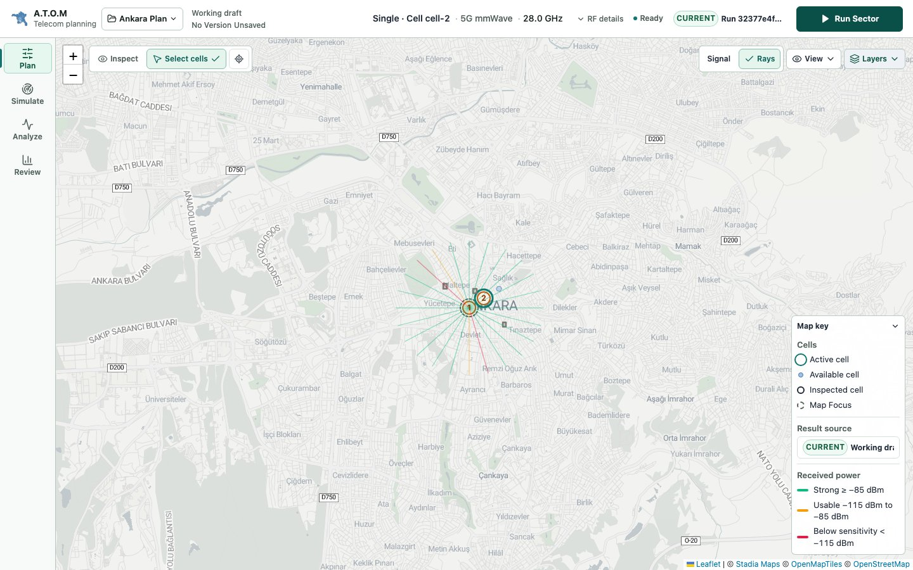 |

## Interference and related actions

`Analyze Interference` is enabled when `networkSelectionCount >= 2` and `isLoading`, `isOptimizing`, and `isAnalyzingInterference` are all false. Unsupported interference technology still uses the existing unavailable guidance. No readiness predicate changed. The captures cover enabled analysis and disabled in-flight analysis; component tests also cover insufficient selection and each busy guard.

The variant used `--slate`, which becomes a pale foreground token in dark mode, under white action text. `.analyze-button` was omitted from the shared dark primary-action selector. The light action itself is accepted and remains unchanged. The shared selector now includes `.analyze-button` and diagnostic `.path-analyze-button`; Optimize, command Run/Evaluate, panel primary and result/apply primary actions share its enabled, hover and disabled rules. Nearby outlined diagnostic-entry actions already use semantic surfaces and explicit disabled/focus states and remain unchanged.

Enabled dark actions use white text/icons on `--action-positive` (`#236b63`), with `--action-positive-hover` (`#2b7a70`). Disabled actions use `--surface-muted` (`#263139`), `--disabled` text/icons (`#8d9d96`), the existing line token, full opacity and `not-allowed` cursor. Native `disabled`, nonactivation and keyboard exclusion remain intact; state is conveyed by behavior, cursor and changed action/loading label as well as color. The existing 2 px focus-visible outline remains intact.

Text contrast is **6.26:1** enabled, **5.10:1** hovered and **4.68:1** disabled. Focus token `#9bd3ff` against panel `#1b2328` is **9.98:1**. Icons inherit the text foreground. Browser checks verify enabled focus, disabled focus exclusion/nonactivation, disabled styling even under hover, and shared command-action appearance. Full computed action snapshots for light enabled, hover and disabled match the before capture exactly.

| Action state | Before | After |
| --- | --- | --- |
| Dark enabled | 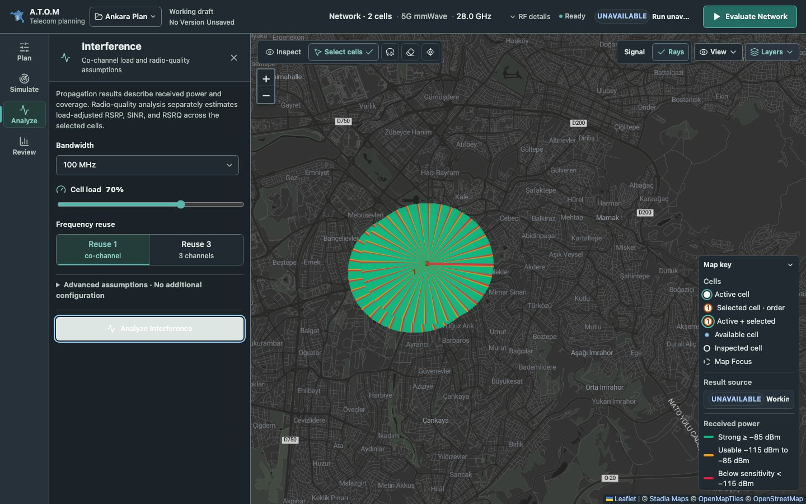 | 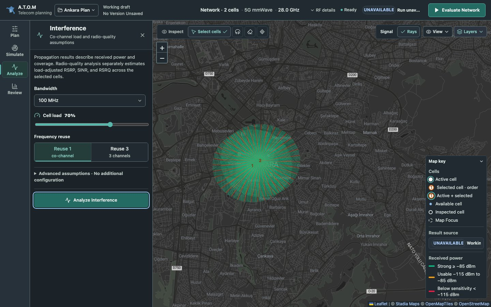 |
| Dark disabled | 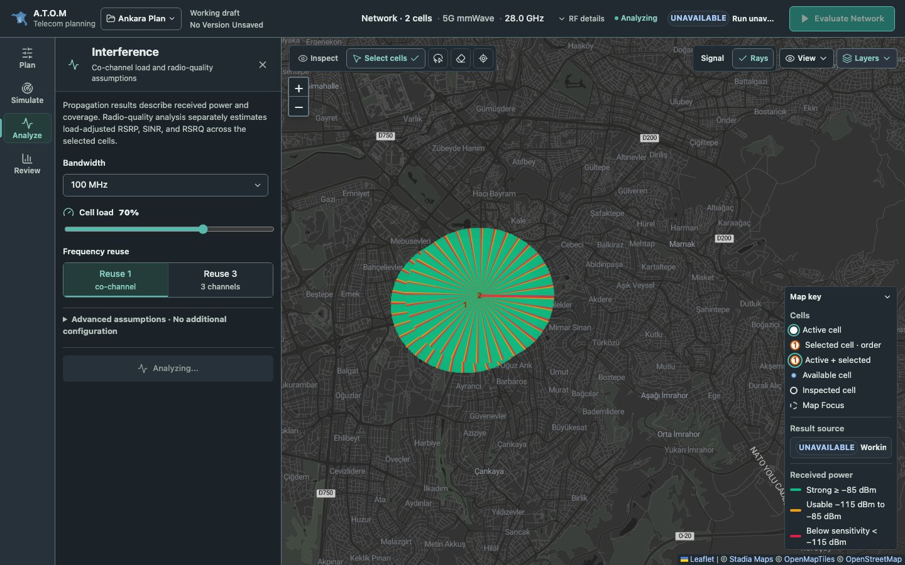 | 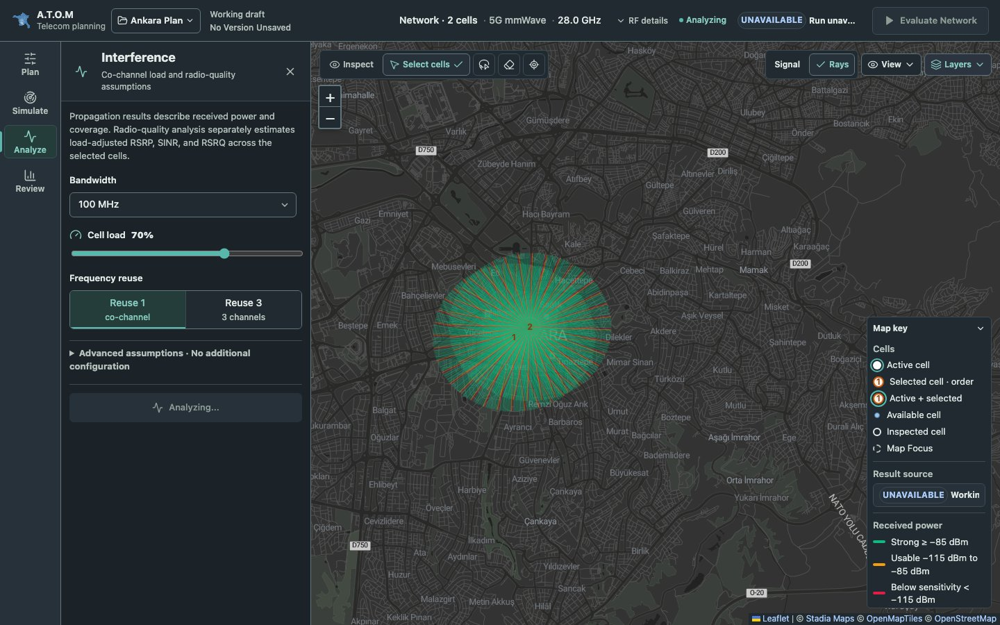 |
| Light enabled | 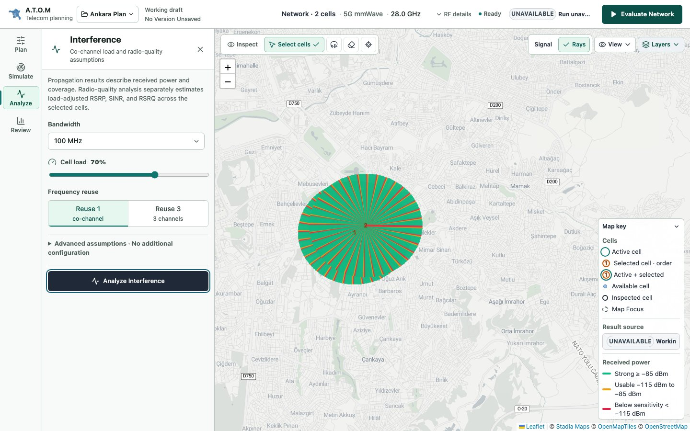 | 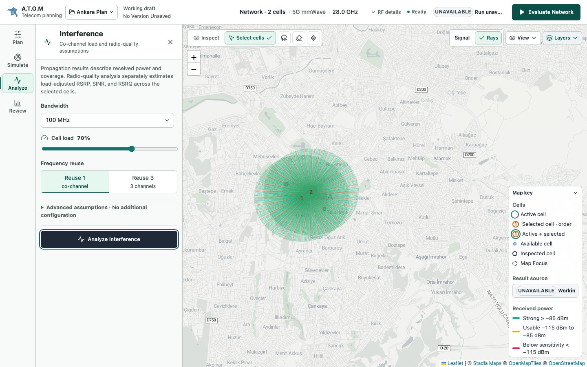 |
| Light disabled | 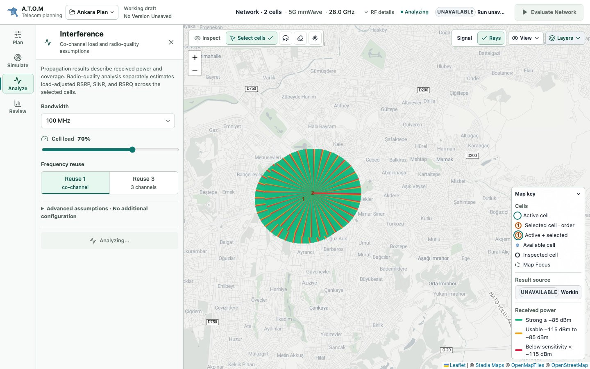 | 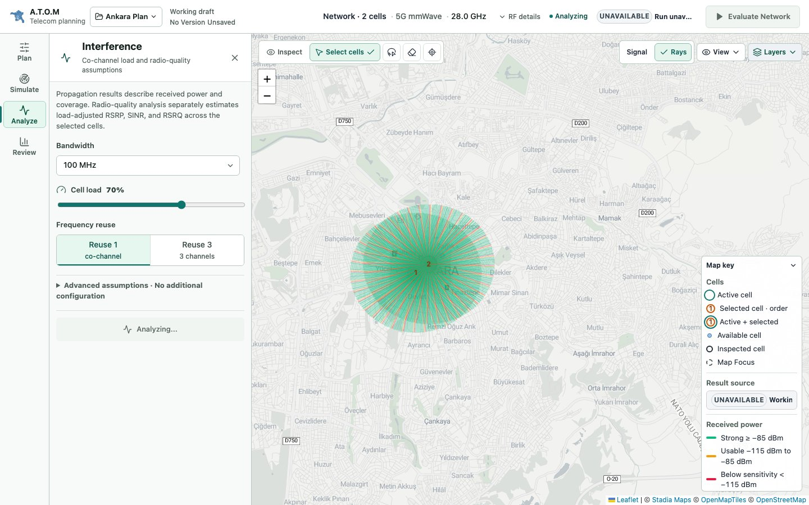 |

## Deferred issue and validation

The observed **“RF analysis request budget exceeded; retry after the current rate-limit window”** is recorded in [the existing dark-mode document](dark-mode.md#deferred-rf-request-budget-issue). Investigation is deferred. No backend, request budget, rate limit, retry or error-handling code changed. A mocked existing 429 response remains visibly rendered in both themes after switching appearance, with one request and no automatic retry.

[Before evidence](assets/dark-mode-follow-up/before.json) and [after evidence](assets/dark-mode-follow-up/after.json) retain canvas paths, action styles, screenshot filenames and request payloads.

Validation from `frontend-react`:

```sh
npm test
npm run lint
npm run build
npx playwright test --project=desktop-1440 --workers=1 --grep 'shared dark actions|basemap switching preserves'
ATOM_PRESENTATION_CAPTURE=1 npx playwright test --project=desktop-1440 --workers=1 --grep 'ray and action presentation'
```

The baseline was captured before the production patch using `ATOM_PRESENTATION_BEFORE=1`. The capture is gated because it uses real provider tiles, reusing the existing successful test-only `/tmp/atom-basemap-tiles` cache. The normal focused browser test uses deterministic API fixtures without requiring remote tiles. Unit tests cover ray style/classes, immutable dense/sparse feature count/geometry/classifications, readiness guards and native action semantics. The full suite also covers request-equivalence and payload invariance. `git diff --check` and the mechanical UI detector pass. The production build succeeds with its existing bundle-size warning.
