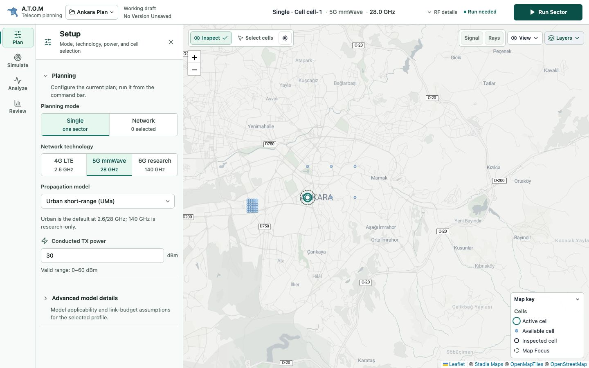
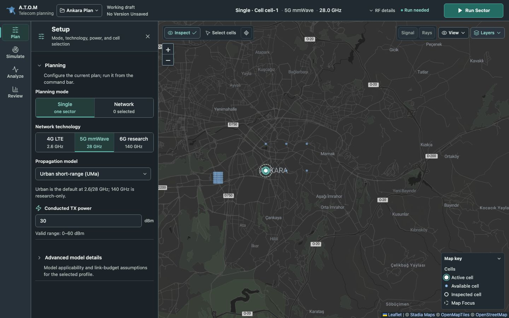
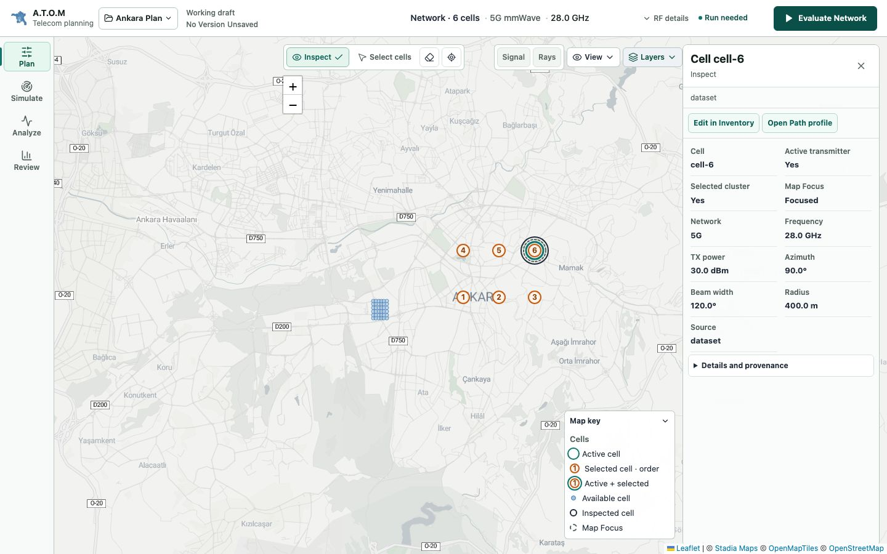
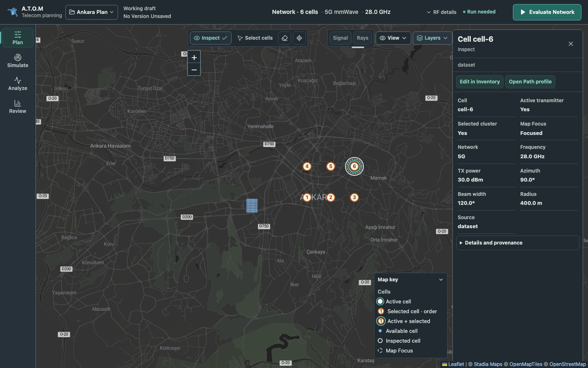
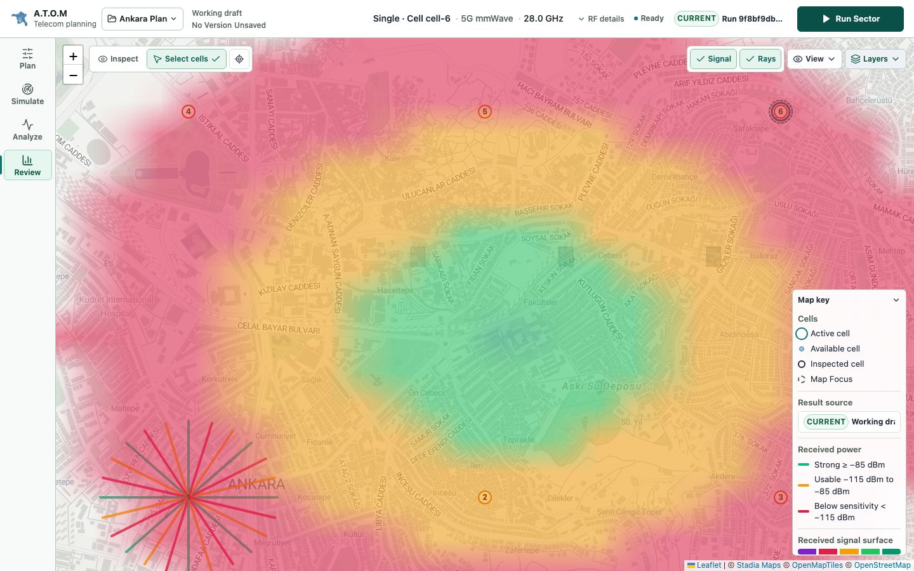
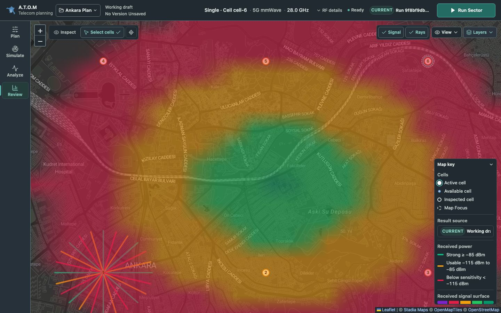

# Matched light/dark visual comparison

The theme retains A.T.O.M's restrained technical hierarchy: the map remains the main work surface, drawers use quiet opaque surfaces, and active states use muted teal. RF category colors remain unchanged. Appearance is explicit in Layers, with visible provider attribution and recovery when tiles fail.

Captures use real Alidade Smooth / Alidade Smooth Dark tiles and the same deterministic 42-cell fixture (including 36 dense Söğütözü cells), building footprints, received-power raster/rays and radio-quality samples. They cover 1440×900, 1366×768, 1512×982 and 390×844. The complete [evidence file](assets/dark-mode/evidence.json) records paired camera, palette, layer, selection and layout measurements plus comparison against the pre-theme light stylesheet (`7765e62`). These are application UI checks, not new scientific validation or a provider benchmark.

| State | Light | Dark | Visual assessment |
| --- | --- | --- | --- |
| Default map | [Capture](assets/dark-mode/default-map-light.jpg) | [Capture](assets/dark-mode/default-map-dark.jpg) | Map chrome recedes; roads and cell states remain readable. |
| Plan menu | [Capture](assets/dark-mode/plan-menu-light.jpg) | [Capture](assets/dark-mode/plan-menu-dark.jpg) | Tool hierarchy, availability and current tool remain explicit. |
| Setup | [Capture](assets/dark-mode/setup-light.jpg) | [Capture](assets/dark-mode/setup-dark.jpg) | Labels, values, explanatory copy, selection and focus contrast remain clear. |
| Appearance/Layers | [Capture](assets/dark-mode/appearance-and-layers-light.jpg) | [Capture](assets/dark-mode/appearance-and-layers-dark.jpg) | Light/Dark/System radio choices and provider selection fit the expanded, scrollable popover. |
| Selected network | [Capture](assets/basemap-alidade/selected-network-alidade-smooth.jpg) | [Capture](assets/dark-mode/selected-network-dark.jpg) | Six centered orange order labels retain the same positions and order. |
| Active, selected, inspected, focused | [Capture](assets/dark-mode/active-selected-cell-light.jpg) | [Capture](assets/dark-mode/active-selected-cell-dark.jpg) | Teal active ring, orange selected/order marker, dashed Focus and solid inspection rings remain separate. |
| Dense cells | [Capture](assets/basemap-alidade/dense-sogutozu-alidade-smooth.jpg) | [Capture](assets/dark-mode/dense-sogutozu-dark.jpg) | Available cells stay quieter than operational cell states. |
| Selection area | [Capture](assets/basemap-alidade/selection-polygon-alidade-smooth.jpg) | [Capture](assets/dark-mode/selection-polygon-dark.jpg) | Orange boundary and vertex handles retain shape, position and category meaning. |
| Buildings | [Capture](assets/basemap-alidade/building-overlay-alidade-smooth.jpg) | [Capture](assets/dark-mode/building-overlay-dark.jpg) | Material colors and opacity stay fixed against the purpose-designed dark raster. |
| SINR | [Capture](assets/dark-mode/sinr-light.jpg) | [Capture](assets/dark-mode/sinr-dark.jpg) | Same red/amber/blue/teal bins and gray No signal, with matching key. |
| RSRP | [Capture](assets/dark-mode/rsrp-light.jpg) | [Capture](assets/dark-mode/rsrp-dark.jpg) | Same metric thresholds and category palette as light. |
| RSRQ | [Capture](assets/dark-mode/rsrq-light.jpg) | [Capture](assets/dark-mode/rsrq-dark.jpg) | Same metric thresholds and category palette as light. |
| View popover | [Capture](assets/dark-mode/map-view-popover-light.jpg) | [Capture](assets/dark-mode/map-view-popover-dark.jpg) | Focus, metric and result display controls share the shell's semantic roles. |
| RF Diagnostics | [Capture](assets/dark-mode/rf-diagnostics-light.jpg) | [Capture](assets/dark-mode/rf-diagnostics-dark.jpg) | Technical copy, actions, disabled state and reference boundaries remain readable. |
| Review 1366 | [Capture](assets/dark-mode/review-1366-light.jpg) | [Capture](assets/dark-mode/review-1366-dark.jpg) | Same layout at the smaller desktop width. |
| Review 1512 | [Capture](assets/dark-mode/review-1512-light.jpg) | [Capture](assets/dark-mode/review-1512-dark.jpg) | Larger canvas retains the same hierarchy and key clearance. |
| Review phone | [Capture](assets/dark-mode/review-390-light.jpg) | [Capture](assets/dark-mode/review-390-dark.jpg) | Attribution wraps; the key keeps its existing scrollable contents and independent clearance. |
| Phone Setup | [Capture](assets/dark-mode/mobile-setup-light.jpg) | [Capture](assets/dark-mode/mobile-setup-dark.jpg) | Dense controls remain readable; the Appearance popover can cross the drawer edge. |
| Phone Appearance/Layers | [Capture](assets/dark-mode/appearance-and-layers-mobile-light.jpg) | [Capture](assets/dark-mode/appearance-and-layers-mobile-dark.jpg) | Radio choices stay reachable above the mobile drawer and Leaflet controls. |
| Current result | [Capture](assets/dark-mode/review-current-light.jpg) | [Capture](assets/dark-mode/review-current-dark.jpg) | Current-result source and RF summary retain their prominence. |
| Signal and Rays | [Capture](assets/dark-mode/signal-rays-light.jpg) | [Capture](assets/dark-mode/signal-rays-dark.jpg) | Identical received-power image and ray categories; map geography remains visible under the unchanged raster opacity. |

Representative comparisons:

| Setup — light | Setup — dark |
| --- | --- |
|  |  |

| Cell states — light | Cell states — dark |
| --- | --- |
|  |  |

| Signal/Rays — light | Signal/Rays — dark |
| --- | --- |
|  |  |

Identical light captures reuse existing basemap evidence files to avoid duplicate documentation assets.

The 19 pre-theme light comparisons check identical computed styles on all visible non-tile elements and negligible screenshot differences: at most two 8-bit channel values across less than 0.2% of pixels, allowing Chromium's composited corner rounding. This run changed at most 201 pixels in a comparison, with a maximum channel delta of 2. Appearance/Layers is the intentional exception because the new preference controls require a wider popover and a dark-provider row. Active menu stacking changes only while Layers is open, to prevent the drawer or Leaflet zoom controls from intercepting pointer events.

Every pair checks unchanged camera/zoom, selected marker order, context/status/action, RF key palette and Signal image. Root and overlay panes retain `filter: none`; only OSM keeps its existing raster filter. Cell-state outline color changes are intentional UI contrast adjustments, so complete overlay canvas hashes can differ across themes while RF geometry and scientific palettes remain fixed. Full exported-project equality and unchanged API request counts are enforced by separate browser contracts.

## Contrast and practical limits

Measured semantic pairs use WCAG relative luminance. Browser tests verify visible shell text at ≥4.5:1, input borders and focus at ≥3:1, including the dark hover state on desktop, tablet and phone.

| Role | Foreground / background | Ratio |
| --- | --- | --- |
| Primary text | `#e3eae7` / `#202a30` | 11.98:1 |
| Secondary text | `#b3c0bb` / `#202a30` | 7.79:1 |
| Disabled text | `#8d9d96` / `#263139` | 4.68:1 |
| Primary action | `#ffffff` / `#236b63` | 6.26:1 |
| Input border | `#63767e` / `#202a30` | 3.08:1 |
| Focus ring | `#9bd3ff` / `#202a30` | 9.17:1 |
| Selection order | `#833c0c` / `#fff3e7` | 7.35:1 |

Raster labels and scientific overlays depend on local geography, opacity and occlusion, so this is not a blanket WCAG certification. The fixed no-signal gray is deliberately quieter than service categories; selected orange rings/orders distinguish cells from amber RF samples by shape. Building materials and received-power categories retain their original semantics. The visual review uses representative fixtures rather than every real dataset condition.

Validation: lint; 343 unit/component/workflow tests across 65 files; 132 responsive E2E cases (120 viewport/environment/capture-gated skips); Go-served production CSP contract; frontend build; backend Go vet/race tests; reference-page build and docs validation; release metadata check; `git diff --check`. The build retains the existing warning about its main bundle size. The design detector flags one pre-existing thick reference-card border; its geometry is retained to honor unchanged light rendering.

For deployment and provider terms, see [Application appearance and dark basemap](dark-mode.md).
