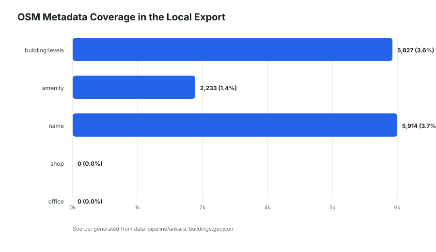
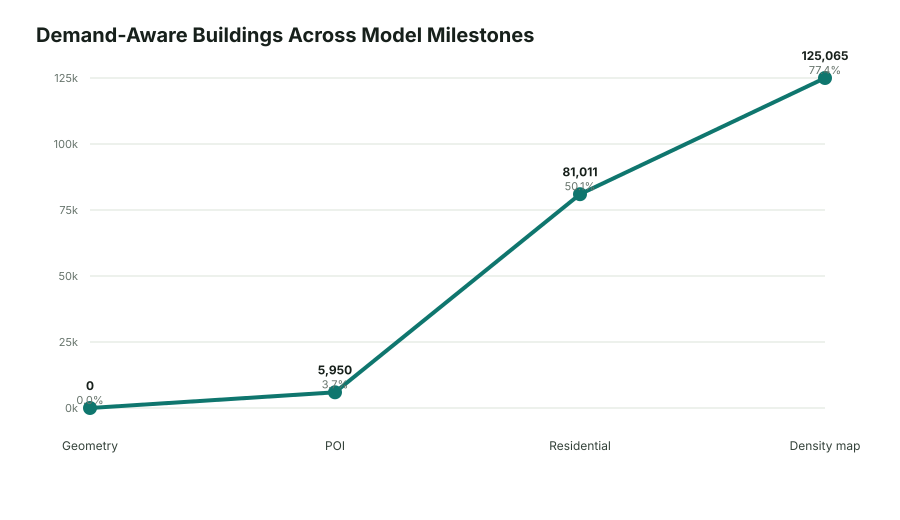
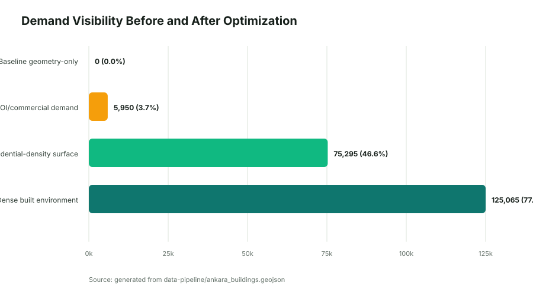
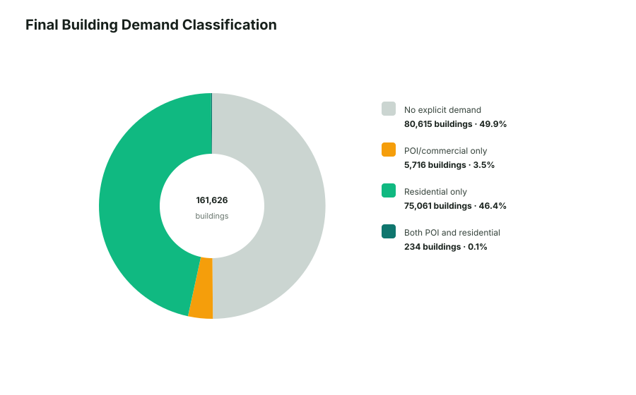

# A.T.O.M: Ankara Telecom Optimization Model

**An Academic Engineering Report on Demand-Aware RF Propagation Simulation for Ankara**

Author: [Berk Unsal](https://berkunsal.com)  
Project: A.T.O.M, Ankara Telecom Optimization Model  
Study Area: Ankara core bounding box, Turkey  

---

## Abstract

A.T.O.M is a full-stack geospatial simulation system for modeling cellular signal propagation across Ankara, Turkey. The project combines OpenStreetMap building footprints, OpenCellID-derived cellular tower data, frequency-dependent radio propagation physics, and a demand-aware beamforming optimizer. The system evolved from a coverage-only model into a residential-density-aware planning tool that reduces the tendency to optimize toward long empty corridors. This report documents the datasets, implementation, mathematical model, optimization process, and measured improvements produced by the final demand surface.

---

## 1. Introduction

Urban cellular planning is difficult because radio propagation is not determined by distance alone. Buildings, dense housing clusters, commercial facilities, and public institutions all affect where network capacity is most valuable. This is especially important for 5G mmWave and future 6G Sub-THz systems, where high frequencies experience severe path loss and wall penetration penalties.

A.T.O.M focuses on Ankara because the city contains a useful mixture of dense residential districts, government and university campuses, commercial corridors, and lower-density peripheral land. The goal is not only to draw theoretical coverage rays, but to estimate where antenna sectors should point when serving meaningful demand.

---

## 2. Datasets

The system uses static local files at runtime. This avoids external API limits and makes simulations reproducible.

| Dataset | Source | Runtime Format | Purpose |
|---|---:|---:|---|
| Cellular nodes | OpenCellID-derived extraction | GeoJSON | Tower/node placement for simulation origins |
| Buildings | OpenStreetMap via OSMnx | GeoJSON | Ray obstruction polygons and demand surface basis |
| Derived demand fields | Local Python enrichment | GeoJSON properties | POI, residential, and density-weighted optimization |

### 2.1 Building Dataset Coverage

The current local export contains **161,626** building footprints. OSM metadata is useful but sparse: `building:levels` exists for 5,827 buildings, `amenity` for 2,233, and `name` for 5,914. The current local export has no retained `shop` or `office` values, so the final optimizer compensates with building-type, name, area, and density heuristics.



### 2.2 Derived Demand Fields

The final exported building file adds the following fields:

| Field | Meaning |
|---|---|
| `demand_weight` | Explicit POI/commercial/critical-service demand |
| `residential_demand` | Population-serving demand from homes and dense residential clusters |
| `density_score` | Local building-density score computed from a 150 m neighborhood |
| `nearby_buildings` | Count of nearby building centroids within 150 m |
| `nearby_residential_buildings` | Count of nearby residential-like buildings within 150 m |
| `weight_reason` / `residential_reason` | Human-readable explanation of why a building was weighted |

---

## 3. System Architecture

A.T.O.M is implemented as a local-first, full-stack geospatial application.

| Layer | Technology | Responsibility |
|---|---|---|
| Data pipeline | Python, GeoPandas, Shapely, OSMnx | Extract towers, export OSM buildings, compute demand fields |
| Simulation backend | Go, Gin, Tidwall R-tree | Load GeoJSON into memory, spatially index buildings, run concurrent ray tracing |
| Frontend | React, Vite, Leaflet | Map rendering, tower selection, beamforming controls, ray heatmap display |
| Deployment | Docker multi-stage build | Build React and Go into a single production container |

The backend loads all tower and building data at startup. Building bounding boxes are inserted into an in-memory R-tree, so each short ray segment only checks nearby candidate polygons instead of scanning the entire city.

---

## 4. Propagation Model

The core propagation model uses Free-Space Path Loss, antenna gain, receiver sensitivity, and frequency-dependent wall penetration.

### 4.1 Free-Space Path Loss

For distance in meters and frequency in GHz:

```text
FSPL(dB) = 20 log10(distance_m) + 20 log10(frequency_GHz) + 92.45
```

Received power is computed from EIRP:

```text
EIRP_dBm = TxPower_dBm + AntennaGain_dBi
Rx_dBm = EIRP_dBm - FSPL(dB) - cumulative_wall_loss
```

The system uses:

| Parameter | Value |
|---|---:|
| Receiver sensitivity | -115 dBm |
| Antenna beamforming gain | +25 dBi |
| Segment step size | 25 m |

### 4.2 Frequency-Dependent Penetration

Wall attenuation depends on network generation:

| Technology | Frequency | Wall Loss Per Intersection | Expected Behavior |
|---|---:|---:|---|
| 4G LTE | 2.6 GHz | 8 dB | Stronger penetration through buildings |
| 5G mmWave | 28 GHz | 30 dB | Limited penetration, fast urban attenuation |
| 6G Sub-THz | 140 GHz | 80 dB | Near-immediate blockage at walls |

### 4.3 Segmented Beam Tracing

Each sector is divided into rays, and each ray is split into 25 m segments. Segments are colored by received power, which creates a visual heatmap rather than a single uniform line.


---

## 5. Optimization Methodology

The optimizer evolved through three major phases.

### 5.1 Phase 1: Geometry-Only Coverage

The initial optimizer maximized:

```text
score = SUM(ray_length_m^2)
```

This made geometric sense, but it overvalued long unobstructed paths, including paths over low-demand or empty land.

### 5.2 Phase 2: POI and Commercial Demand

The second optimizer introduced `demand_weight` for buildings such as malls, hospitals, universities, schools, and commercial footprints:

```text
score = coverage_score + demand_score
demand_score = SUM(unique_hit_building.demand_weight) * 10000
```

This improved prioritization of high-value targets but still undercounted homes because most residential buildings lacked rich OSM tags.

### 5.3 Phase 3: Residential-Density Surface

The final model adds a residential demand layer:

```text
score = demand_score + residential_score + coverage_tiebreaker
```

The coverage component is now capped and normalized as a tie-breaker. This prevents a long clear ray over empty land from dominating a shorter ray serving dense housing.

Residential demand is assigned from:

- Residential building types such as `apartments`, `residential`, `house`, `detached`, and `semidetached_house`.
- Building levels when available.
- Local density within a 150 m neighborhood.
- Dense generic `building=yes` clusters that likely represent settlement patterns.



---

## 6. Results and Before/After Analysis

The most important improvement is the number of buildings that the optimizer can interpret as demand.

| Phase | Demand-Aware Buildings | Share of Dataset | Interpretation |
|---|---:|---:|---|
| Baseline geometry-only | 0 | 0.0% | Buildings block signal but do not represent demand |
| POI/commercial demand | 5,950 | 3.7% | High-value facilities and explicit demand targets are recognized |
| Residential-density surface | 75,295 | 46.6% | Homes and dense residential clusters influence optimization |
| Dense built environment | 125,065 | 77.4% | Local settlement density is available as a planning feature |



The final demand classification is:

| Category | Count |
|---|---:|
| No explicit demand | 80,615 |
| POI/commercial only | 5,716 |
| Residential only | 75,061 |
| Both POI and residential | 234 |



The result is a more realistic optimizer: high-value facilities still matter, but dense housing is no longer invisible. This makes the model better suited for population-serving antenna planning.


---

## 7. Implementation Notes

### 7.1 Python Data Pipeline

The Python pipeline performs:

1. Tower extraction and filtering from OpenCellID-derived data.
2. Building footprint export from OSMnx/OSM.
3. Offline enrichment of building footprints.
4. Demand and density scoring.
5. GeoJSON export for static runtime loading.

The report charts are generated from the same GeoJSON file using a dependency-free SVG generator:

```bash
python3 docs/report/generate_report_charts.py
```

### 7.2 Go Backend

The Go backend performs:

- GeoJSON parsing.
- R-tree spatial indexing.
- Concurrent ray simulation with goroutines.
- Segment-polygon intersection checks.
- Frequency-dependent penetration loss.
- Beamforming and azimuth optimization.

The optimizer returns:

```json
{
  "optimal_azimuth": 240,
  "coverage_score": 1200,
  "demand_score": 450000,
  "residential_score": 900000,
  "hit_demand_buildings": 12,
  "hit_residential_buildings": 40,
  "data_quality": "good"
}
```

### 7.3 React Frontend

The frontend provides:

- Tower markers and interactive tower selection.
- Network generation switching for 4G, 5G, and 6G.
- Azimuth and beam-width controls.
- Auto-Optimize action.
- Heatmap-like ray visualization using GeoJSON segments.
- Optimizer diagnostics for demand, residential, and coverage contributions.

---

## 8. Discussion and Limitations

The final model is stronger than the initial geometry-only optimizer, but it remains an approximation.

| Limitation | Impact | Future Remedy |
|---|---|---|
| Sparse OSM metadata | Some shops/offices are missing from the current local export | Preserve richer OSM tags during fresh export |
| Synthetic residential demand | Density is an inferred proxy for population | Add GHSL, WorldPop, or municipality population grids |
| Simplified RF physics | No full diffraction, reflection, or multipath model | Add calibrated propagation models and field measurements |
| Static environment | No traffic, mobility, or temporal demand | Add time-dependent demand layers |
| Single-sector optimization | Optimizes one active tower sector at a time | Add multi-sector and multi-tower optimization |

The density surface is intentionally transparent: every weighted building records why it was assigned demand. This makes the model inspectable even when external population data is unavailable.

---

## 9. Conclusion

A.T.O.M demonstrates how a local geospatial simulation engine can combine RF propagation physics with demand-aware optimization. The project moved from pure ray coverage to a richer planning model that accounts for critical POIs, commercial sites, residential buildings, and local settlement density. The final model recognizes 75,295 residential-demand buildings and 5,950 POI/commercial-demand buildings, substantially improving the optimizer’s ability to point sectors toward places where service is valuable rather than merely where rays travel farthest.

Future development should validate the model against measured RF data and replace synthetic residential proxies with authoritative population rasters. Even in its current local-first form, A.T.O.M provides a strong foundation for explainable cellular network planning in dense urban environments.

---

## Reproducibility

Regenerate charts:

```bash
python3 docs/report/generate_report_charts.py
```

Regenerate enriched building data offline:

```bash
data-pipeline/.venv/bin/python data-pipeline/fetch_buildings.py \
  --offline-input data-pipeline/ankara_buildings.geojson \
  --output data-pipeline/ankara_buildings.geojson
```

Run validation:

```bash
PYTHONPYCACHEPREFIX=/private/tmp/atom-pycache data-pipeline/.venv/bin/python -m py_compile \
  data-pipeline/export_ankara_buildings.py data-pipeline/fetch_buildings.py

cd backend-go
GOCACHE=/private/tmp/atom-gocache go test ./...
cd ..

cd frontend-react
npm run build
```
