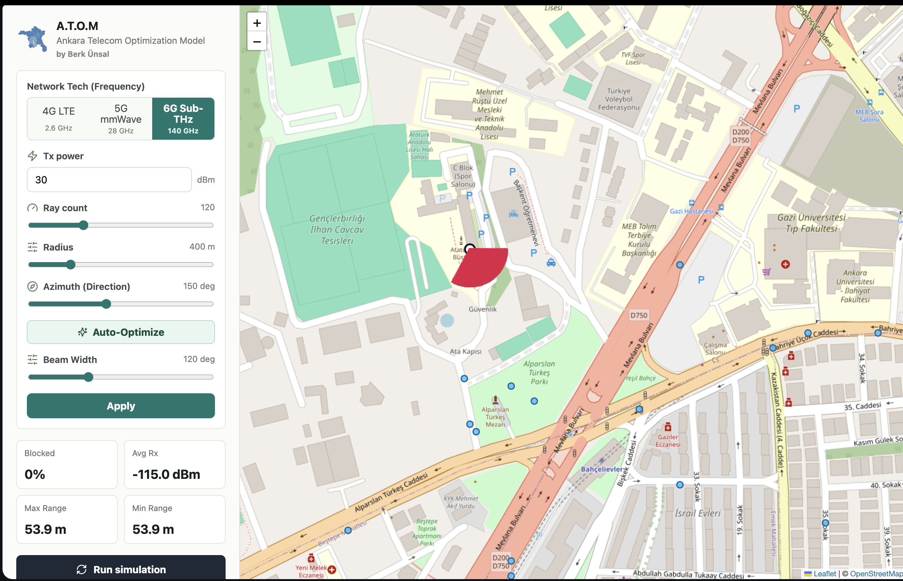

# Propagation Visualization

A.T.O.M visualizes deterministic RF planning estimates across frequency bands using Ankara's urban topology. The images are model outputs, not measured coverage maps.

## 4G LTE Coverage (2.6 GHz)

### Characteristics

- **Wavelength**: 11.5 cm
- **Coverage Type**: Wide-area with building penetration
- **Penetration Loss**: roughly +8 dB per wall crossing in the current LTE model
- **Urban Canyon Effect**: Moderate (signals reach side streets)

### Interpretation

The 4G simulation shows:

- 🟢 **Green zones**: Strong indoor coverage (-50 to -70 dBm)
- 🟡 **Yellow zones**: Moderate coverage (-70 to -90 dBm), usable for typical applications
- 🔴 **Red zones**: Marginal coverage (-90 to -110 dBm), possible dead zones

**Key Insight**: Lower FSPL and the model's lower per-wall loss generally let 4G estimates extend farther than higher-frequency modes.

---

## 5G mmWave Coverage (28 GHz)

### Characteristics

- **Wavelength**: 1.07 cm
- **Coverage Type**: Directional, urban-specific hotspots
- **Penetration Loss**: roughly +30 dB per wall crossing in the current mmWave model
- **Line-of-Sight Requirement**: Often necessary for usable signal

### Interpretation

The 5G visualization reveals:

- 🟢 **Green zones**: Excellent LOS coverage on main avenues
- 🟡 **Yellow zones**: Partial coverage after distance and wall-loss attenuation
- 🔴 **Red zones**: Deep urban canyons blocked by building walls

**Key Insight**: 5G requires careful site placement to reach street-level users. Antenna orientation (azimuth) dramatically affects coverage.

---

## 6G Sub-THz Coverage (140 GHz)

### Characteristics

- **Wavelength**: 2.14 mm (near-optical)
- **Coverage Type**: Ultra-localized, street-level only
- **Penetration Loss**: roughly +80 dB per wall crossing in the current Sub-THz model
- **Line-of-Sight Requirement**: Mandatory for coverage

### Interpretation

The 6G heatmap demonstrates:

- 🟢 **Green zones**: Only direct line-of-sight points
- 🟡 **Yellow zones**: Minimal; mostly absent
- 🔴 **Red zones**: Vast majority (blocked by buildings)

**Key Insight**: 6G requires a **"pave the streets"** deployment model with frequent small cells (every 50-100 meters). Coverage beyond the immediate vicinity is impractical.

---

## Auto-Optimized 5G Sector

### Algorithm Result

This simulation shows the optimal antenna azimuth computed by A.T.O.M's sweep-and-score algorithm:

- **Demand-aware score**: POI demand, residential-density demand, and capped coverage tie-breakers guide azimuth selection
- **Beam Width**: 65° (typical 3-sector configuration)
- **Optimization Runtime**: ~250 ms

### Interpretation

The auto-optimized placement achieves:

- ✅ Stronger demand-serving direction within distance constraints
- Stronger modeled coverage toward demand-weighted locations
- A reproducible azimuth recommendation from the configured sweep

**Key Insight**: The optimizer consistently compares candidate azimuths using the same demand and coverage score. It does not predict live-network spectral efficiency.

---

## Color Mapping Reference

All visualizations use the same **signal strength to color mapping**:

| Color | Signal Range | Quality | Use Case |
|-------|-------------|---------|----------|
| 🟢 Green | -50 to -70 dBm | Excellent | Voice, video, IoT |
| 🟡 Yellow | -70 to -90 dBm | Good | Voice, messaging |
| 🔴 Red | -90 to -110 dBm | Poor | Emergency services |
| ⚫ Black | < -110 dBm | No service | (Not shown) |

---

## Comparative Analysis: 4G vs 5G vs 6G

### Coverage Radius Comparison

| Technology | Typical Radius | Max Radius |
|-----------|---------------|-----------|
| **4G** | 2 km (urban) | 5 km (rural) |
| **5G mmWave** | 300 m planning preset | 1 km configurable limit |
| **6G Sub-THz** | 50 m (LOS) | 200 m (exceptional) |

### Site Density Required

| Technology | Sites per km² | Building Density Impact |
|-----------|------------|------------------------|
| **4G** | 1-3 | Low (penetrates walls) |
| **5G mmWave** | 10-50 | High (requires LOS) |
| **6G Sub-THz** | 100+ | Very High (street-level) |

### Urban Canyon Effect

The visualizations clearly show how **building density** impacts each band:

- **4G**: Usually produces the broadest modeled reach because FSPL and wall loss are lower.
- **5G**: Produces more localized, directional modeled coverage at 28 GHz.
- **6G**: Is a research overlay with the strongest configured wall attenuation and shortest practical range.

---

## Understanding the Heatmaps

### Ray Segments

Each heatmap consists of thousands of **ray segments** (colored lines):

- **Start Point**: Transmitter antenna
- **End Point**: Coverage measurement location (typically 20-100 meters away)
- **Color**: Represents signal strength at that distance/direction
- **Direction**: Shows propagation pattern and antenna beam orientation

### Reading the Visualization

1. **Green Zones**: Primary coverage area; reliable service expected
2. **Yellow Zones**: Secondary coverage; service possible with optimal conditions
3. **Red Zones**: Marginal; not recommended for primary coverage
4. **No Color**: Below sensitivity threshold; no usable signal

### Analytical Surface Layer

The Surfaces tool replaces dense point markers with a regular received-power raster drawn below operational markers. Adjust opacity to compare it with the basemap and select a display floor to hide weaker cells. Contours are unsmoothed marching-square line segments at the selected dBm thresholds; they are deterministic grid evidence, not kriged measurement isolines.

The raster uses the fast sector FSPL/antenna/wall model. It does not inherit optional terrain, gas, rain, vegetation, or diffraction settings from a point-to-point profile.

Enable **Viewport buildings** in Layers at zoom 12 or closer to request only the visible building footprints. Fill hue reflects normalized material when known and opacity increases modestly with inferred height; it is contextual geometry, not a surveyed 3D mesh.

### Vertical Path Profile

The Propagation tool's path view shows ground, building tops, endpoint elevations, the direct LOS line, 60% Fresnel clearance, and any dominant obstruction. The adjacent component table is the authoritative explanation of which optional losses were enabled. A red obstruction does not imply a complete multiple-edge diffraction or reflected-path solution.

### Interactive Exploration

In the web interface, you can:

- 🔄 Adjust antenna azimuth and watch coverage rotate
- 📊 Switch between frequency bands and compare
- 🎯 Toggle beamforming on/off to see impact
- 📍 Click points to see exact signal strength (Rx dBm)

---

## Validation Boundary

A.T.O.M has not been calibrated against operator drive tests or UE measurements. Treat Rx, RSRP, SINR, and RSRQ values as planning estimates for scenario comparison, then validate deployment decisions with calibrated tools and field measurements.

---

## Export and Integration

Analytical surfaces can be exported as float32 EPSG:4326 GeoTIFF, contour GeoJSON, or grid-center CSV. Viewport building queries return GeoJSON or CSV/WKT. These can be used in:

- 🗺️ **ArcGIS**: Professional GIS analysis
- 🌍 **Google Earth**: 3D visualization
- 📋 **QGIS**: Open-source mapping
- 🔗 **Custom applications**: Any GeoJSON-compatible tool

---

**Next**: Learn the physics behind these visualizations in [Algorithms & Physics](algorithms.md).
